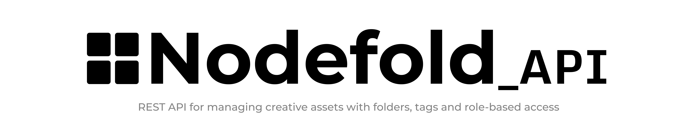
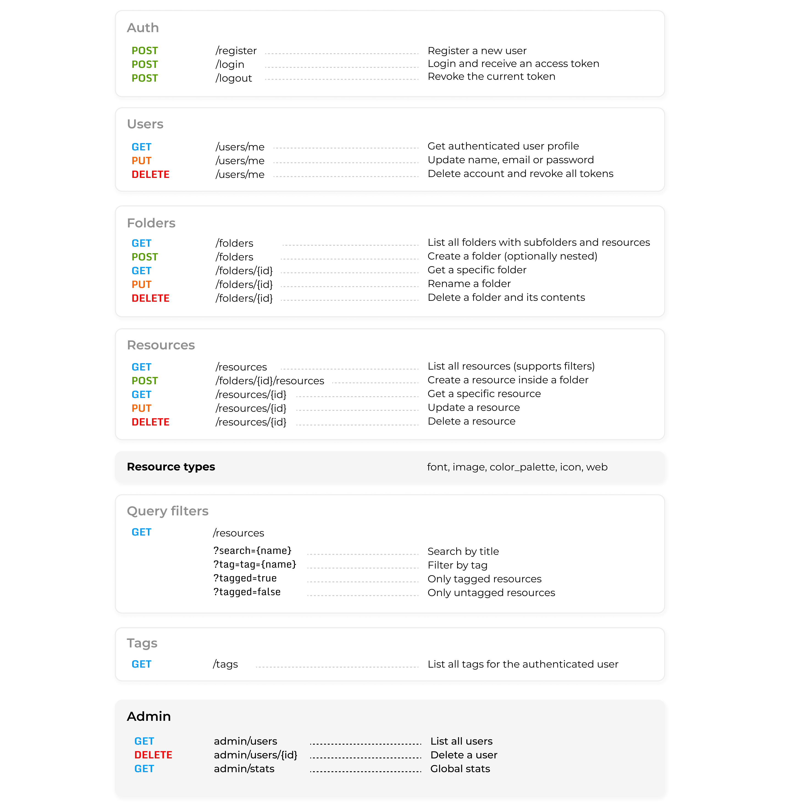

<p align="center">
  
</p>

<p align="center">
  <a href="https://nodefold-api.onrender.com/docs"><strong>📄 Live Documentation</strong></a> - Cold start may take ~45s on first request
</p>

<p align="center">
  <sub></sub>
</p>

## 📚 Table of Contents

- [About](#about)
- [Tech Stack](#-tech-stack)
- [Features & Endpoints](#features--endpoints)
- [Setup & Installation](#-setup--installation)
- [Environment Variables](#-environment-variables)
- [Docker & Deployment](#-docker--deployment)
- [Demo Accounts](#demo-accounts)
- [API Documentation](#-api-documentation)
- [Postman Collection](#-postman-collection)
- [Upcoming Improvements](#-upcoming-improvements)

## About

**Nodefold API** is the backend REST API powering the Nodefold design asset manager. It provides a structured way to organize creative resources into folders and subfolders, with support for tagging, filtering and role-based access control.

Built with Laravel and secured with Laravel Passport (OAuth2), it follows RESTful conventions with versioned endpoints under /api/v1/

## 💻 Tech Stack

- **Runtime:** PHP 8.4
- **Framework:** Laravel 12
- **Authentication:** Laravel Passport (OAuth2 — Personal Access Tokens)
- **Database:** PostgreSQL (production) / MySQL (local)
- **Documentation:** Scribe + Scalar
- **Testing:** PHPUnit (Laravel Test Suite) — 43+ tests
- **Containerization:** Docker + Nginx
- **Deployment:** Render

## Features & Endpoints

All endpoints are prefixed with /api/v1/

<p align="center">
  
</p>

## 🔧 Setup & Installation

**Prerequisites**

- PHP >= 8.4
- Composer
- MySQL or PostgreSQL
- Laravel Passport

**Clone the repository**

```
git clone https://github.com/miguelm-montano/nodefold-api.git
cd nodefold-api
```

**Install dependencies**

```
composer install
```

**Configure environment**

```
cp .env.example .env
php artisan key:generate
```

Update your _.env_ with your database credentials (see [Environment Variables](#-environment-variables))

**Run migrations and install Passport**

```
php artisan migrate
php artisan passport:install
```

**Create storage symlink**

```
php artisan storage:link
```

**Start the development server**

```
php artisan serve
```

The API will be available at http://localhost:8000/api/v1/

**Run tests**

```
php artisan test
```

## 🔑 Environment Variables

```
APP_NAME=Nodefold
APP_ENV=local
APP_KEY=
APP_DEBUG=true
APP_URL=http://localhost:8000

DB_CONNECTION=mysql
DB_HOST=127.0.0.1
DB_PORT=3306
DB_DATABASE=nodefold_api
DB_USERNAME=root
DB_PASSWORD=

LOG_CHANNEL=stack
LOG_LEVEL=debug
```

For **production (Render)**, the following variables are required:

```
APP_ENV=production
APP_DEBUG=false
APP_KEY=                  # Generate with: php artisan key:generate --show
APP_URL=https://your-app.onrender.com
DATABASE_URL=             # PostgreSQL internal URL from Render
```

## 🐳 Docker & Deployment

The project includes a full Docker setup for containerized deployment.

**Files**

- Dockerfile — PHP 8.4 + Nginx image
- docker/nginx.conf — Nginx server configuration
- docker/start.sh — Startup script (migrations, Passport install, Scribe docs generation)

**Run locally with Docker**

```
docker build -t nodefold-api .
docker run -p 8000:10000 --env-file .env nodefold-api
```

**Production deployment (Render)**
The API is deployed on Render using Docker

**Live Docs:** https://nodefold-api.onrender.com/docs

⚠️ The free plan on Render spins down after inactivity. The first request may take 30–60 seconds to respond

## Demo Accounts

Use these accounts to test the API quickly without registering:

```
php artisan db:seed
```

<p align="center">

| Role  |       Email        | Password  |
| :---: | :----------------: | :-------: |
| Admin | admin@nodefold.com | Admin1234 |
| User  | user@nodefold.com  | User1234  |

</p>

⚠️ php artisan migrate:fresh --seed will reset the database and remove all existing data

## 📖 API Documentation

Interactive API documentation is generated with Scribe and rendered with Scalar.

<p align="center">
  
</p>

**Access locally**

```
php artisan scribe:generate
```

Then visit: http://localhost:8000/docs

**Live documentation**

https://nodefold-api.onrender.com/docs

The documentation includes:

- Full endpoint reference with request/response examples
- Authentication instructions
- Quick start guide
- Downloadable OpenAPI spec and Postman collection

## 📮 Postman Collection

A Postman collection and environment are included in the /postman directory:

- Nodefold_API_postman_collection.json
- Nodefold_Local_postman_environment.json

**Import instructions**

1. Open Postman
2. Click Import and select both files
3. Select the Nodefold Local environment
4. Set the base_url variable:

- Local: http://localhost:8000/api/v1
- Production: https://nodefold-api.onrender.com/api/v1

5. Use **Register** or **Login** to obtain a token — it is saved automatically to the token variable

The collection includes pre-request scripts that automatically store the Bearer token after login or register, so you don't need to set it manually for subsequent requests.

## 🚧 Upcoming Improvements

- Email verification
- Pagination on GET /resources and GET /admin/users
- Sorting resources by creation date
- Filter by resource type (?type=font)
- Improved detection of sequential passwords
